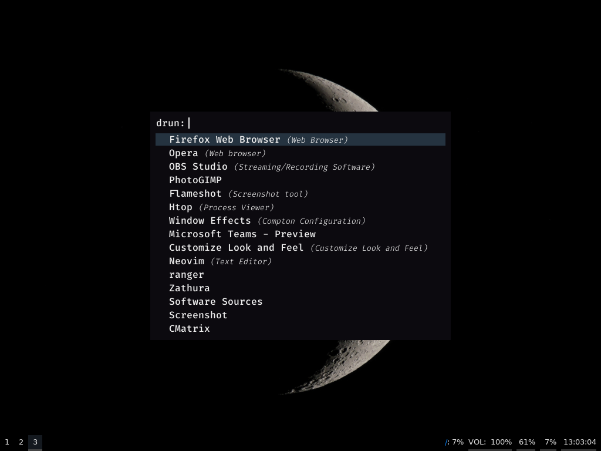

# Dalton for Rofi

Dalton is a minimal theme for Rofi, very black with some blue.

# Install

First, you need to install the Fira Code Font, if you is in a linux distro, you can download Fira Code using your package manager, see the instructions in [the Fira Code install guide](https://github.com/tonsky/FiraCode/wiki/Linux-instructions)

Create the directory `.config/rofi`, and copy the `dalton.rasi` to this folder.

Now, you can use the argument `-theme` with dalton, like this:

`rofi  -show drun -theme dalton`

# More dalton themes for another programs

[Dalton for Vim](https://github.com/edersonferreira/dalton-vim)
